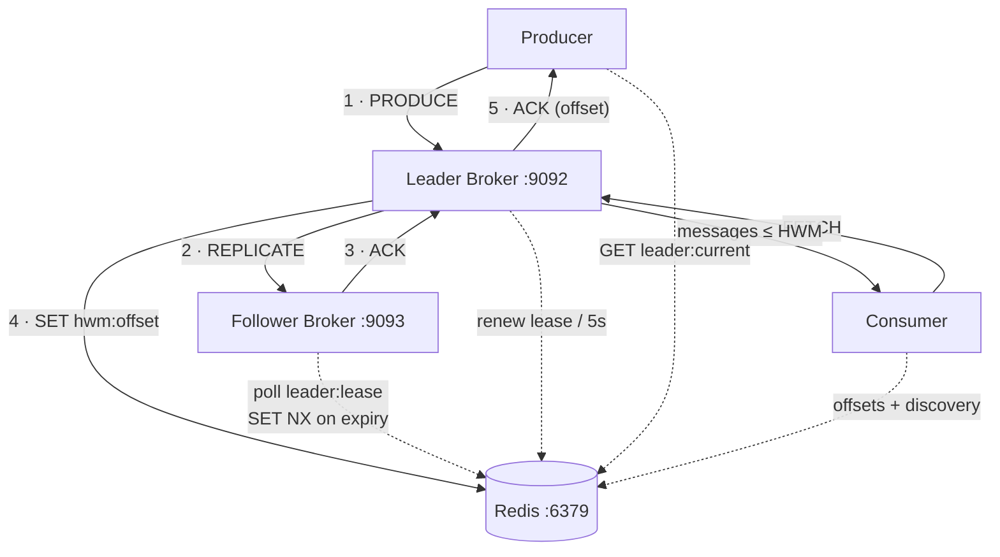

# YAK — Yet Another Kafka

**A fault-tolerant, Kafka-style distributed message broker implemented from scratch in
Python.** No Kafka libraries — the wire protocol, replicated log, leader election, and
failover-aware clients are all built directly on TCP sockets and Redis.

Kill the leader mid-stream and the system keeps going: a follower detects the failure,
elects itself through an atomic Redis lease, and producers and consumers rediscover the
new leader on their own. Every message that was acknowledged before the crash is still
readable afterwards.

Built by a team of four for a Big Data course, and run across four physical machines.

---

## What it does

- **Multi-broker leader/follower architecture** — one leader accepts all writes, one
  follower maintains a byte-identical replica at identical offsets.
- **Synchronous replication** — the leader does not acknowledge a producer until the
  follower has confirmed the write. Committed means *replicated*.
- **High-water-mark read semantics** — consumers can only read offsets at or below the
  HWM, so nothing un-replicated is ever visible.
- **Leader election via atomic Redis lease** — `SET NX EX` means exactly one broker can
  win. Split-brain is prevented structurally, not probabilistically.
- **Failure detection** — the leader renews a 30s lease every 5s; the follower elects
  after three consecutive missed checks. Observed failover: ~15–20 seconds.
- **Client failover** — producers and consumers discover the leader through Redis, fall
  back to querying brokers directly, and retry through a leader change with no
  reconfiguration.
- **At-least-once delivery** — offsets commit to Redis after processing; producer
  retries carry the original UUID and are deduplicated at the broker.
- **Streaming flight-data pipeline** — 18,338 real US flight delay records streamed one
  message at a time, with analytics in plain Python and in Spark.

---

## Architecture



Steps 1–5 are strictly ordered: the producer's ACK is the *last* thing to happen, after
the follower already has the message. That ordering is the entire durability argument.

Redis holds only coordination state — the leader lease, the current leader address, the
HWM, and per-consumer offsets. Message data never passes through it.

**[→ Full architecture, protocol, and failure analysis](docs/ARCHITECTURE.md)**

---

## Guarantees

Stated precisely, under the failure model actually tested — the leader process is killed;
Redis and the follower survive:

| Property | |
|---|---|
| Committed messages survive leader failure | **Yes** — ACK follows replication; only offsets ≤ HWM are readable |
| Single leader at a time | **Yes**, given a reachable Redis (`SET NX`) |
| Ordering | **Yes** for a single producer connection; not across concurrent producers |
| Delivery semantics | **At-least-once** (not exactly-once) |
| Durability across broker restart | **No** — the log is in memory only |
| Replication continues after failover | **No** — the promoted follower runs unreplicated |
| Redis failure tolerance | **No** — Redis is a single point of failure |
| Partitions / consumer groups | **Not implemented** |

This is a from-scratch implementation of Kafka's *mechanisms*, not a Kafka replacement.
See [Limitations](#limitations).

---

## Tech stack

**Python 3.8+** · **Redis** (coordination) · **PySpark 3.5** (batch analytics) ·
raw **TCP sockets** with a length-prefixed JSON protocol · `threading` for concurrency.

Runtime dependency for the broker itself is just `redis`. Spark, pandas and numpy are
only needed for the analytics job.

---

## Quick start

Single machine, four terminals. Start the follower **before** the leader.

```bash
pip install -r requirements.txt
```

```bash
# 1 — Redis
redis-server
```

```bash
# 2 — Follower
python -m follower_broker.follower --host 0.0.0.0 --port 9093 --redis-host localhost
```

```bash
# 3 — Leader
python -m leader_broker.leader --host 0.0.0.0 --port 9092 \
    --follower-host localhost --follower-port 9093 --redis-host localhost
```

```bash
# 4 — Produce, then consume
python -m producer.producer --brokers localhost:9092 localhost:9093 \
    --redis-host localhost --batch 100

python -m consumer.consumer --consumer-id demo --brokers localhost:9092 localhost:9093 \
    --redis-host localhost --from-beginning --fetch-all
```

Stream the flight dataset instead:

```bash
python -m producer.flight_data_producer --csv data/FlightDelay2.csv \
    --brokers localhost:9092 localhost:9093 --redis-host localhost \
    --max-records 1000 --fast

python -m consumer.flight_data_consumer --consumer-id analytics \
    --brokers localhost:9092 localhost:9093 --redis-host localhost --batch
```

**[→ Full setup, including the four-machine deployment](docs/SETUP.md)**

---

## Demonstration

The failover demo, in one paragraph: produce 100 messages and confirm `hwm:offset` is
`99`. Kill the leader with `kill -9` so it never releases its lease. Watch the follower
log three missed checks and then `LEADERSHIP ACQUIRED`. Run the *same* producer command
again — it prints `Discovered leader: …:9093` and commits at offset 100, with nothing
reconfigured. Then consume from the beginning and count: **101 messages**, all 100
pre-crash ones served from what was the replica.

```bash
bash scripts/demo_failover.sh            # test messages
bash scripts/demo_complete_pipeline.sh   # flight data + Spark
```

Both scripts pause for you to kill the leader by hand.

**[→ Step-by-step demo guide, with expected output](docs/DEMO.md)**

---

## Flight data pipeline

`data/FlightDelay2.csv` — 18,338 US Bureau of Transportation Statistics flight records:
10 carriers, 335 origin airports, 5,013 distinct routes, delays from 0 to 1,403 minutes.

Each row is streamed as one message through the full replicated path, then analyzed two
ways: an in-process consumer computing delay rates, carrier and route rankings; and a
Spark job adding hourly delay profiles and distance-bucket comparisons, writing
Parquet/JSON/CSV.

The dataset is what makes the failover demo checkable — stream 1000, kill the leader,
stream 100 more, and confirm 1,100 records are readable afterwards.

**[→ Dataset, schema, pipeline, and analytics caveats](docs/FLIGHT_DATA.md)**

---

## Testing

Integration tests run against a live cluster (`python scripts/test_integration.py`):
end-to-end produce/consume with content verification, sustained batch production,
consumer offset durability across process restart, and HWM readability.

Failover itself is verified manually, following the demo guide — there is no automated
test for it.

**[→ What each test covers, and what isn't covered](docs/TESTING.md)**

---

## Team

Built for **Big Data (UE23CS343AB2)**, PES University, 2025. The system ran distributed
across four machines, one node per member.

| Member | GitHub | Node |
|---|---|---|
| Aditya Sharma | [@Sharma-Aditya7](https://github.com/Sharma-Aditya7) | Leader broker |
| Laxman Srivastava | [@laxmanclo](https://github.com/laxmanclo) | Follower broker + Redis |
| Devyani | [@devyani648](https://github.com/devyani648) | Consumer |
| Rishika | [@rishika207](https://github.com/rishika207) | Producer |

See **[docs/CONTRIBUTIONS.md](docs/CONTRIBUTIONS.md)**.

---

## Limitations

Stated plainly, because the interesting part of this project is knowing where the edges
are:

- **No disk persistence.** Both logs are in-memory Python lists. A restarted broker comes
  back empty; stopping both brokers loses everything regardless of the HWM.
- **The promoted follower runs unreplicated.** It has no follower of its own and does not
  replicate writes it accepts after promotion. The cluster survives one failure, not two.
- **No rejoin path.** A restarted leader finds the lease held, prints
  `Cannot start as leader`, and exits. There is no catch-up or demotion.
- **Redis is a single point of failure.** No election, discovery, or offset commit is
  possible without it.
- **No partitions, no consumer groups, one topic.** No horizontal scaling.
- **Ordering holds for a single producer connection only** — append and replicate are not
  performed under one lock, so concurrent producers can interleave. Details in
  [ARCHITECTURE.md](docs/ARCHITECTURE.md#ordering-caveat).
- **No batching or pipelining.** One message per replication round trip bounds throughput
  to the low hundreds per second on a LAN. No benchmark figures are published here
  because none were recorded; the producer prints its own measured rate if you want a
  number for your setup.
- **No authentication, authorization, or TLS.** Plain TCP. Do not expose these ports
  outside a trusted network.
- **Client retry budget is short** — 3 attempts, 2s apart, against a 15–20s failover
  window. A producer caught mid-failover reports failure and recovers on re-invocation.

---

## Documentation

| | |
|---|---|
| [ARCHITECTURE.md](docs/ARCHITECTURE.md) | Protocol, log, replication, election, guarantees, known gaps |
| [SETUP.md](docs/SETUP.md) | Install, single-machine and four-machine deployment, troubleshooting |
| [DEMO.md](docs/DEMO.md) | Failover walkthroughs with expected output |
| [FLIGHT_DATA.md](docs/FLIGHT_DATA.md) | Dataset, streaming pipeline, Spark analytics |
| [TESTING.md](docs/TESTING.md) | Test coverage and its gaps |
| [CONTRIBUTIONS.md](docs/CONTRIBUTIONS.md) | Team and node roles |

---

## License

Academic project, released for educational and portfolio purposes.

Flight data derived from the US Bureau of Transportation Statistics on-time performance
dataset (public domain). Architecture inspired by Apache Kafka.
