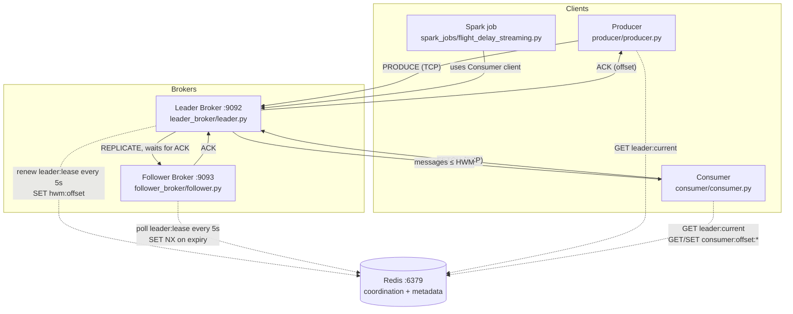
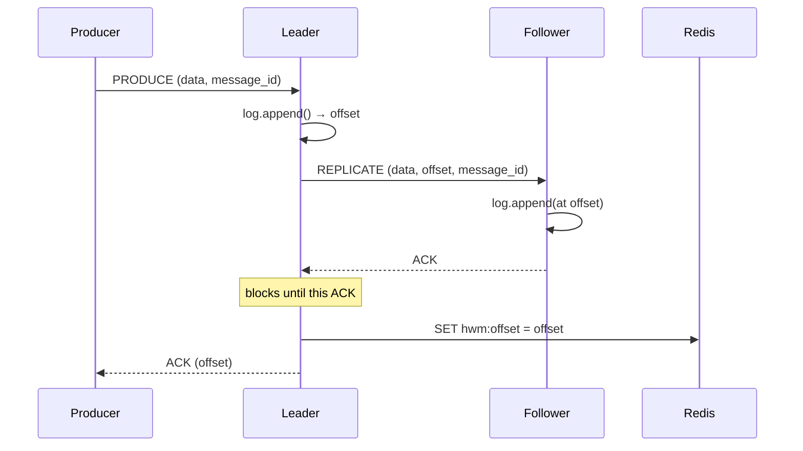
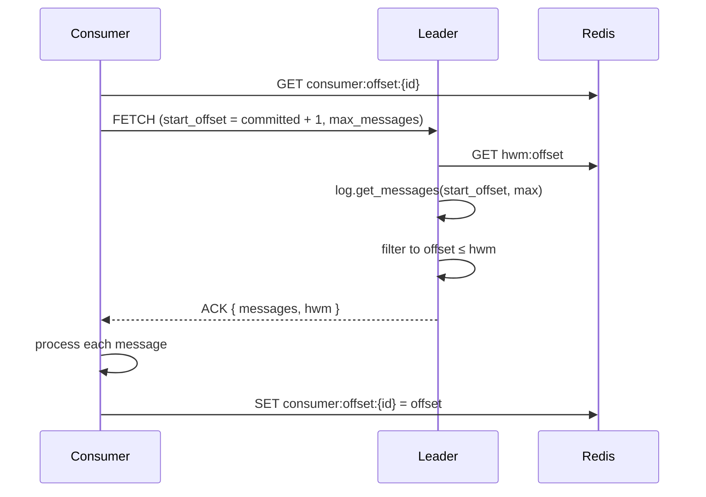
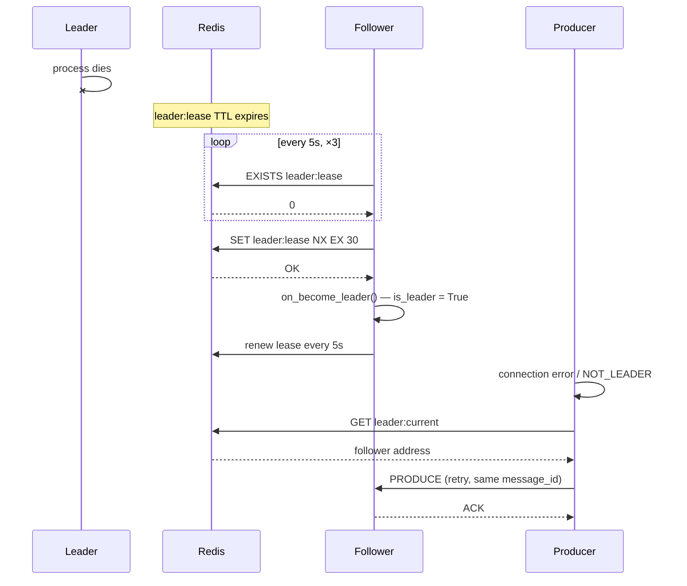

# Architecture

YAK is a leader/follower message broker written from scratch in Python. There is no
Kafka library anywhere in the codebase — the wire protocol, the log, the replication
path, the election, and the clients are all implemented directly on TCP sockets and
Redis.

This document describes what the code actually does. Where a guarantee is weaker than
it might first appear, that is called out explicitly.

---

## Component map



Every arrow marked TCP carries the same framed-JSON protocol described below. Redis is
never on the message data path — only coordination state lives there.

---

## Wire protocol

`common/protocol.py` defines a single `Message` type serialized as JSON and framed with
a 4-byte big-endian length prefix:

```
[4 bytes: payload length][N bytes: UTF-8 JSON]
```

The JSON body is always the same shape, with unused fields left null:

```json
{
  "type": "PRODUCE",
  "data": "message payload",
  "offset": 42,
  "timestamp": 1699272000.123,
  "message_id": "uuid4-string"
}
```

Message types: `PRODUCE`, `REPLICATE`, `FETCH`, `ACK`, `HEARTBEAT`, `METADATA`, `ERROR`.
`HEARTBEAT` is defined in the protocol but unused — liveness is carried entirely by the
Redis lease TTL rather than by broker-to-broker pings.

`receive_message()` loops on `recv()` until the full framed payload arrives, so messages
larger than one TCP segment are handled correctly.

---

## The log

Both brokers keep an in-memory log (`leader_broker/log_manager.py`,
`follower_broker/log_manager.py`). A `LogEntry` is `(offset, data, message_id,
timestamp)`. Appends take a `threading.Lock`, so concurrent client handler threads are
serialized.

**There is no disk persistence.** A broker that restarts comes back with an empty log.
This is the single largest departure from Kafka and it bounds every durability claim in
this document.

Deduplication is by `message_id`: each `LogManager` keeps a `set` of seen ids, and an
append whose id is already present returns the existing offset instead of writing a
second copy. Because the producer reuses the same UUID when it retries, a retry after a
partial failure is idempotent at the broker.

The two log managers differ in one deliberate way:

- The **leader's** `append()` assigns offsets itself from a monotonic `next_offset`.
- The **follower's** `append()` accepts an explicit `offset` argument and writes the
  entry at the offset the leader chose, advancing `next_offset` to `offset + 1` if the
  incoming offset is ahead. This keeps replica offsets identical to the leader's rather
  than merely sequential. The follower's `get_messages()` and `get_message_at_offset()`
  correspondingly scan by stored offset instead of indexing the list positionally.

---

## Redis coordination

Four keys, all defined in `common/redis_client.py`:

| Key | Value | TTL | Purpose |
|---|---|---|---|
| `leader:lease` | `{"host":…,"port":…}` | `LEADER_LEASE_TTL` (30s) | The actual lease. Its existence *is* the liveness signal. |
| `leader:current` | `{"host":…,"port":…}` | none | Leader address for client discovery. |
| `hwm:offset` | integer | none | High-water mark — highest offset confirmed replicated. |
| `consumer:offset:<id>` | integer | none | Per-consumer committed read position. |

Redis is a single point of failure in this design. If Redis goes down, no leader can be
elected, no client can discover a leader, and no consumer offsets can be committed. The
brokers do not replicate Redis.

---

## Write path



The replication is **synchronous** in the strict sense: `handle_produce_request()` calls
`ReplicationManager.replicate_message()` and does not send the producer's ACK until the
follower's ACK has been received. If replication fails after 3 retries the leader
returns a `REPLICATION_ERROR` to the producer and does **not** advance the HWM.

`ReplicationManager` holds one long-lived TCP connection to the follower and reconnects
on error. Replication is one message per round trip — there is no batching or
pipelining, which is the dominant throughput limit (see [Performance](#performance)).

### Ordering caveat

The leader handles each client connection on its own thread. `log.append()` is
lock-protected, but the append and the subsequent replication are **not** performed
under a single lock. With a single producer connection — how the system is run and
demonstrated — writes are serialized and offsets replicate in order. With multiple
concurrent producer connections, two threads can interleave between their append and
their replicate calls, so the follower may receive offsets out of order. The follower
tolerates this (it writes at the offset it is told), but `hwm:offset` is written with
whatever offset finished last rather than with a true contiguous watermark. The HWM is
therefore only a reliable "everything below this is replicated" marker under
single-producer operation.

---

## Read path



Consumers never see an offset above the HWM. Since the HWM only advances after a
follower ACK, a consumer only ever reads data that exists on both brokers. That is the
committed-message property the system is built around.

Offsets are committed to Redis **after** the message is processed, one commit per
message. This gives **at-least-once** delivery: a consumer that crashes between
processing and committing will reprocess that message on restart. It is not
exactly-once, despite what earlier drafts of this documentation claimed.

---

## Failure detection and election

`follower_broker/election.py` runs a monitor thread that polls Redis every
`HEARTBEAT_INTERVAL` (5s) and checks whether `leader:lease` still exists. The leader
holds that lease alive by re-`SET`ting it with a 30s TTL every 5s from
`renew_lease_loop()`.

Detection requires **3 consecutive** observations of a missing lease before an election
is attempted, so the follower waits at least ~15s past lease expiry. Combined with the
30s TTL, the observed failover window is roughly 15–20 seconds in the configuration
that ships here — the follower usually notices near the end of the TTL rather than
waiting a further full 30s.

Election itself is a single atomic operation:

```python
client.set("leader:lease", leader_info, nx=True, ex=lease_ttl)
```

`SET … NX EX` is atomic in Redis, so exactly one candidate can win. This is what
prevents two brokers from believing they are leader at the same instant, given a
reachable Redis.



### What the promoted follower can and cannot do

On promotion, `FollowerBroker.on_become_leader()` sets `is_leader = True` and starts
renewing the lease. It then accepts `PRODUCE` and `FETCH`, which it rejected with
`NOT_THE_LEADER` while it was a follower.

Crucially, **the promoted follower has no follower of its own.** `handle_produce_request()`
in `follower.py` appends to its local log and sets the HWM directly, with no replication
step — the code comments this explicitly. So after failover the cluster runs as a single
un-replicated broker. Messages accepted post-failover live on exactly one node, in
memory, and are lost if that node dies too. The system degrades from
replicated to unreplicated; it does not re-form a replica set.

There is also no rejoin path. A restarted leader calls `acquire_leadership()`, finds the
lease held, prints `Cannot start as leader` and exits. It does not fall back to follower
mode or catch up its log.

---

## Client failover

Both clients share the same failover shape (`producer/producer.py`,
`consumer/consumer.py`):

1. Discover the leader via `GET leader:current` in Redis.
2. If Redis is unreachable, fall back to sending a `METADATA` request to each address in
   the `--brokers` list until one answers.
3. On a connection error, or on an `ERROR` response with `error_type == "NOT_LEADER"`,
   drop the cached leader and socket, sleep `RECONNECT_DELAY` (2s), and retry — up to
   `MAX_RETRIES` (3).

The producer retries with the **same** `message_id`, so a message that was actually
committed before the failure is deduplicated rather than duplicated on retry.

Note that the retry budget is small: 3 attempts at 2s apart covers ~6s, while failover
takes 15–20s. A producer that is mid-send when the leader dies will exhaust its retries
and report failure; it recovers when re-invoked, which is how the demo scripts drive it.
The backoff is a fixed 2s delay, not exponential.

---

## Guarantees

Stated precisely, under the failure model that was actually exercised (single leader
process killed; Redis and the follower survive; brokers are not restarted):

| Property | Status |
|---|---|
| Committed messages survive leader failure | **Yes.** A message is only ACKed after the follower has it, and only offsets ≤ HWM are readable. The promoted follower holds every committed message. |
| Single leader at a time | **Yes**, given a reachable Redis — enforced by `SET NX`. |
| Message ordering | **Yes** for a single producer connection. Not guaranteed across concurrent producers (see write-path caveat). |
| Delivery semantics | **At-least-once.** Offsets commit after processing; producer retries are deduplicated by `message_id`. |
| No duplicate writes on producer retry | **Yes**, via `message_id` dedup in both log managers. |
| Durability across broker restart | **No.** Logs are in-memory only. |
| Continued replication after failover | **No.** The promoted follower runs unreplicated. |
| Redis failure tolerance | **No.** Redis is a single point of failure. |
| Partitioning / horizontal scaling | **Not implemented.** One log, one topic, no partitions, no consumer groups. |

The phrase "zero data loss" appears in earlier versions of this repository's docs. The
accurate statement is narrower: *committed messages are not lost when the leader process
dies, under the tested failure model.* Uncommitted in-flight writes, and everything in
memory if both brokers stop, are lost.

---

## Performance

The system has one measurement instrument built into it: the producer times its own
batch and prints a rate. `Producer.send_batch()` and `FlightDataProducer.stream_flight_data()`
both compute `records / elapsed` and print it.

That rate is bounded by the design: every message costs a full producer→leader→
follower→leader→producer round trip plus a Redis `SET`, with no batching. Throughput is
therefore in the hundreds of messages per second on a LAN, and the number you get is
whatever your network and hardware produce — **no benchmark figure is published here,
because no benchmark results were recorded in this repository.** Run the batch producer
yourself if you want a number for your setup; see [TESTING.md](TESTING.md).

Failover time is the one timing that is structurally determined rather than measured:
3 consecutive 5-second checks past lease expiry, giving the ~15–20s window described
above.

---

## Known gaps

Beyond the architectural limits above, these are real issues in the current code:

- **Leader duplicate-path bug.** In `leader.py`, `handle_produce_request()` treats
  `offset is None` as the duplicate case and rescans the log to recover the offset. But
  `LogManager.append()` already returns the existing offset for a duplicate and only
  returns `None` in an unreachable branch. The rescan is dead code.
- **`ReplicationManager` is shared across threads.** One socket, no lock, used by every
  client handler thread. Concurrent producers can interleave writes on it.
- **Follower's `get_messages()` is O(n) per fetch**, scanning the whole log rather than
  seeking. Fine at demo scale.
- **`MAX_BATCH_SIZE` is configured but unused** — there is no batched replication path.
- **`MessageType.HEARTBEAT`** is defined and never sent.
- **No authentication, authorization, or encryption.** Plain TCP, no TLS. Do not expose
  these ports outside a trusted network.

---

## Compared with Apache Kafka

| | YAK | Apache Kafka |
|---|---|---|
| Storage | In-memory list | Segmented disk log |
| Replication | 1 synchronous follower | Configurable ISR, N replicas |
| Coordination | Redis lease (`SET NX EX`) | KRaft / ZooKeeper |
| Partitions | None — one log | Many, per topic |
| Consumer groups | None — per-consumer offsets | Full group protocol with rebalancing |
| Protocol | JSON over TCP | Binary |
| Retention | Unbounded (until process exit) | Time- and size-based |
| After failover | Runs unreplicated | New leader elected from ISR, replication continues |

YAK implements the *mechanisms* — leases, synchronous replication, high-water marks,
atomic election, client-side leader discovery. It does not implement the operational
machinery that makes those mechanisms survivable in production.
