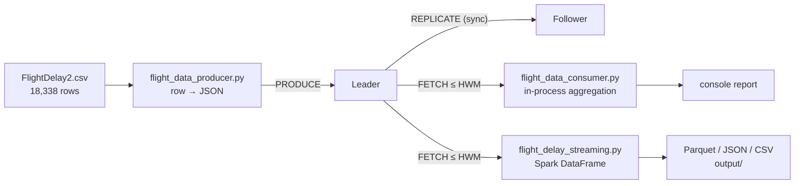

# Flight data pipeline

The workload the broker was built to carry: US domestic flight delay records streamed
one message at a time through the leader, replicated, and analyzed on the other side —
first by a plain-Python consumer, then by Spark.

The point of the pipeline is that it is a *real, non-uniform, streaming* workload rather
than synthetic `Test message N` strings. It is what makes the failover demo meaningful:
you can lose the leader mid-stream and check that the record count on the far side still
adds up.

---

## The dataset

`data/FlightDelay2.csv` — an extract of US Bureau of Transportation Statistics on-time
performance data. Every figure below is measured from the file in this repository.

| | |
|---|---|
| Records | **18,338** (plus a header row) |
| File size | ~515 KB |
| Columns | 8 |
| Carriers | 10 |
| Origin airports | 335 |
| Destination airports | 334 |
| Distinct routes | 5,013 |
| Departure delay range | 0 – 1,403 minutes |
| Arrival delay range | 0 – 1,407 minutes |
| Distance range | 61 – 5,095 miles |
| Scheduled duration range | 35 – 690 minutes |

Carrier mix:

| Carrier | Flights | | Carrier | Flights |
|---|---:|---|---|---:|
| AA | 4,718 | | B6 | 677 |
| WN | 4,174 | | NK | 648 |
| UA | 3,273 | | F9 | 515 |
| DL | 2,896 | | G4 | 236 |
| AS | 983 | | HA | 218 |

The file carries a UTF-8 BOM, which is why every reader in this repo opens it with
`encoding='utf-8-sig'`.

### Schema

```csv
Marketing_Airline_Network,Origin,Dest,CRSDepTime,DepDelayMinutes,ArrDelayMinutes,CRSElapsedTime,Distance
UA,MAF,IAH,1710,0,0,95,429
UA,ORF,IAD,1450,28,68,73,157
```

| Column | Meaning |
|---|---|
| `Marketing_Airline_Network` | Carrier code (AA, WN, UA, …) |
| `Origin` / `Dest` | Airport codes |
| `CRSDepTime` | Scheduled departure, `HHMM` — note `945` means 09:45, not 94:50 |
| `DepDelayMinutes` | Departure delay, minutes; 0 if on time or early |
| `ArrDelayMinutes` | Arrival delay, minutes; 0 if on time or early |
| `CRSElapsedTime` | Scheduled duration, minutes |
| `Distance` | Miles |

Delays are floored at 0 — early arrivals are recorded as `0`, not as negative numbers.
So "average delay" in any output below means *average delay among delayed flights*, and
carries no information about how early on-time flights were.

**Missing values:** 22 rows have a blank `DepDelayMinutes` and 36 have a blank
`ArrDelayMinutes`. `flight_data_producer.py` coerces blanks to `0` on ingest, which
silently merges "no data" into "not delayed" — a small bias worth knowing about before
quoting any delay rate as a fact about air travel.

---

## Path through the system



Each CSV row becomes one broker message. There is no batching anywhere in this path —
one row, one `PRODUCE`, one synchronous replication round trip, one ACK.

### Producer — `producer/flight_data_producer.py`

Validates that all 8 expected columns are present before streaming anything, then reads
the CSV row by row with `csv.DictReader`, converts each row to a flat JSON object, and
hands it to the ordinary `Producer` client — so the flight producer inherits leader
discovery, retry, and failover unchanged.

Per-record wire payload:

```json
{
  "airline": "UA",
  "origin": "ORF",
  "destination": "IAD",
  "departure_time": "1450",
  "departure_delay": 28,
  "arrival_delay": 68,
  "flight_time": 73,
  "distance": 157,
  "timestamp": 1699272000.123
}
```

`timestamp` is ingest wall-clock time, not the flight's scheduled time.

```bash
# 1000 records, no artificial delay
python -m producer.flight_data_producer \
    --csv data/FlightDelay2.csv \
    --brokers localhost:9092 localhost:9093 \
    --redis-host localhost \
    --max-records 1000 --fast

# paced at ~10 records/sec, to watch replication live
python -m producer.flight_data_producer \
    --csv data/FlightDelay2.csv \
    --brokers localhost:9092 localhost:9093 \
    --redis-host localhost \
    --delay 100

# the whole file
python -m producer.flight_data_producer \
    --csv data/FlightDelay2.csv \
    --brokers localhost:9092 localhost:9093 \
    --redis-host localhost --fast
```

| Flag | Default | |
|---|---|---|
| `--csv` | `data/FlightDelay2.csv` | Input file |
| `--brokers` | *required* | `host:port` list; pass both brokers |
| `--delay` | `100` | Milliseconds between records |
| `--fast` | off | Overrides `--delay` to 0 |
| `--max-records` | all | Stop after N |

It prints a running rate every 100 records and a summary at the end (records sent,
failed, elapsed, average rate). Those are measurements of the run in front of you — the
rate is bounded by the synchronous replication round trip, so it reflects your network
and hardware. **No throughput figure from any past run is recorded in this repository,
and none is claimed in these docs.**

`--fast` streaming the entire file means 18,338 sequential round trips; expect it to
take a while, and prefer `--max-records` for demos.

### Consumer — `consumer/flight_data_consumer.py`

Wraps the ordinary `Consumer`, parses each message's JSON, and accumulates counters in
process (`collections.defaultdict`) — no external store. It computes:

- total / delayed / on-time counts and delay rate
- total and average delay minutes
- top 10 carriers by flight count, with share
- top 10 busiest routes
- carriers by average delay, **minimum 5 delayed flights** to qualify
- routes by average delay, **minimum 3 delayed flights** to qualify

Those minimums exist to stop a single 400-minute outlier on a one-off route from topping
the table. They also mean the "worst delays" tables are not a ranking of the whole
dataset.

```bash
# fetch everything available, report once
python -m consumer.flight_data_consumer \
    --consumer-id flight-analytics \
    --brokers localhost:9092 localhost:9093 \
    --redis-host localhost --batch

# stay attached, re-report every 10s as data arrives
python -m consumer.flight_data_consumer \
    --consumer-id flight-analytics \
    --brokers localhost:9092 localhost:9093 \
    --redis-host localhost --continuous
```

Report shape (values depend on how much you streamed):

```
📊 Overall Statistics:
  Total Flights Processed: …
  Delayed Flights: …
  Delay Rate: …%
  Average Delay: … minutes

✈️  Top Airlines by Flight Count:
  AA: … flights (…%)
  ...
```

Offsets commit to Redis after each record, so a `--continuous` consumer resumes where it
left off across restarts and across a leader failover. That also means re-running
`--batch` with the same `--consumer-id` picks up from the stored offset rather than
re-reading — use a fresh id, or reset:

```bash
redis-cli SET consumer:offset:flight-analytics -1
```

Unlike `consumer/consumer.py`, this one has **no `--from-beginning` flag**; resetting the
Redis key is the way.

### Spark — `spark_jobs/flight_delay_streaming.py`

Despite the filename, this is a **batch** job, not Spark Structured Streaming. It uses
the ordinary `Consumer` client to pull all available messages, builds a Spark DataFrame
from them with an explicit schema, and runs the analysis. It runs in Spark **local
mode** — no cluster needed, just a JDK.

Analyses beyond what the plain consumer does:

- `avg` / `max` over departure and arrival delay via DataFrame aggregates
- carrier and route aggregates as Spark SQL groupBys, same 5/3 minimum thresholds
- **delay by scheduled departure hour** — parses `HHMM` by string length, so `945` →
  hour 9 and `1450` → hour 14
- **distance buckets** — short (<500 mi), medium (500–1000), long (>1000) — compared by
  average delay

```bash
python -m spark_jobs.flight_delay_streaming \
    --brokers localhost:9092 localhost:9093 \
    --redis-host localhost \
    --consumer-id spark-analytics-consumer \
    --save --output output/flight_analysis
```

With `--save`, writes three formats under `--output` (gitignored):

| Path | Format | Use |
|---|---|---|
| `…/parquet/` | Parquet | columnar, for further processing |
| `…/json/` | JSON | human-readable |
| `…/summary_csv/` | CSV | `DataFrame.describe()` output |

Note it saves the **input DataFrame**, not the aggregate tables — those are printed to
the console only.

The whole dataset is collected into a single driver's memory before the DataFrame is
built, so this scales to the demo dataset and not much further. It demonstrates the
Spark API against broker-sourced data; it is not a distributed ingest path.

---

## Using it in the failover demo

The record count is the assertion. Stream 1000, kill the leader, stream 100 more into
the promoted follower, then count what a consumer can read: 1,100. That number is only
reachable if every message committed before the crash survived on the replica.

Full walkthrough in [DEMO.md](DEMO.md#demo-b--failover-with-flight-data).

One thing to be clear about when presenting: the second batch re-reads the top of the
same CSV, so those 100 records duplicate the first 100 *by content*. They are separate
messages with separate UUIDs at separate offsets, which is what the count is testing.
The pipeline does not deduplicate by flight identity — only by `message_id`.

---

## Caveats on the analytics

- **Delays are floored at zero,** so nothing here measures early arrivals.
- **Blanks are coerced to 0,** conflating missing data with on-time (58 rows total).
- **No date or time-zone column** exists in the extract. `CRSDepTime` is local to the
  origin airport, so the hourly delay profile mixes time zones.
- **`departure_delay + arrival_delay` is used as "total delay"** in both the consumer and
  the Spark job. These are correlated — a late departure usually causes a late arrival —
  so that sum double-counts and is a ranking device, not a real quantity of lost time.
- **The 5-delayed-flight and 3-delayed-flight minimums** shape the "worst" tables
  substantially at small `--max-records` values.
- **The dataset is an extract**, not a complete period, so carrier shares here are not
  US market shares.

The pipeline is honest about what it computes; it just shouldn't be read as a finding
about the airline industry.
